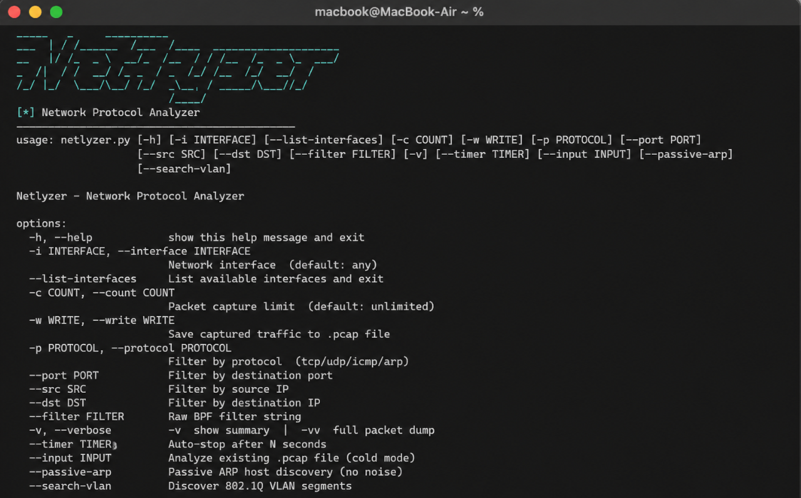

<div align="center">

# NETLYZER — Network Protocol Analyzer


<br>



</div>

---

## Features

- **Live packet capture** on any network interface
- **Offline PCAP analysis** (cold mode) — no interface needed
- **Protocol detection** — TCP, UDP, ICMP, DNS, HTTP, ARP, FTP, SSH/SFTP, DHCP
- **HTTP inspection** — method, host, path, and POST payload extraction
- **Security alert engine** — detects STP, OSPF, HSRP, VRRP, LLMNR, mDNS, NBT-NS, DHCP attacks, CDP, VLAN hopping, SSDP/UPnP
- **Passive ARP discovery** — maps IP → MAC silently
- **VLAN segment discovery** — detects 802.1Q tagged frames
- **PCAP export** — save captured traffic to `.pcap` files
- **Traffic statistics** — protocol breakdown, top ports, packet rate, avg size
- **Timed capture** — auto-stop after N seconds
- **BPF filter support** — raw or composed filter strings

---

## Requirements

- Python 3.8+
- Linux or macOS (raw socket capture requires root)
- The following Python packages:

```
scapy
colorama
```

Install dependencies:

```bash
pip install -r requirements.txt
```

> **Note:** On some systems use `pip install -r requirements.txt --break-system-packages`

---

## Installation

```bash
# Clone the repository
git clone https://github.com/junaidace/netlyzer.git
cd netlyzer

# Install dependencies
pip install -r requirements.txt

# (Optional) Install as a system command
sudo cp netlyzer.py /usr/local/bin/netlyzer
sudo chmod +x /usr/local/bin/netlyzer
```

---

## Usage

```bash
sudo python3 netlyzer.py [OPTIONS]
```

Or if installed system-wide:

```bash
sudo netlyzer [OPTIONS]
```

> Live capture always requires `sudo`. Cold mode (`--input`) does not.

---

## All Commands

### Interface

```bash
# List available network interfaces
sudo netlyzer --list-interfaces

# Capture on a specific interface
sudo netlyzer -i eth0

# Capture on any interface (default)
sudo netlyzer
```

### Capture Control

```bash
# Limit to 100 packets
sudo netlyzer -i eth0 -c 100

# Auto-stop after 30 seconds
sudo netlyzer -i eth0 --timer 30

# Save capture to a .pcap file
sudo netlyzer -i eth0 -w capture.pcap
```

### Filtering

```bash
# Filter by protocol
sudo netlyzer -i eth0 -p tcp
sudo netlyzer -i eth0 -p udp
sudo netlyzer -i eth0 -p icmp
sudo netlyzer -i eth0 -p arp

# Filter by port
sudo netlyzer -i eth0 --port 80
sudo netlyzer -i eth0 --port 443

# Filter by source or destination IP
sudo netlyzer -i eth0 --src 192.168.1.5
sudo netlyzer -i eth0 --dst 8.8.8.8

# Raw BPF filter string
sudo netlyzer -i eth0 --filter "tcp port 443 and host 192.168.1.1"

# Combine filters
sudo netlyzer -i eth0 -p tcp --port 443 --src 192.168.1.5
```

### Verbosity

```bash
# Normal output (default)
sudo netlyzer -i eth0

# Summary-level verbose
sudo netlyzer -i eth0 -v

# Full Scapy packet dump
sudo netlyzer -i eth0 -vv
```

### Special Modes

```bash
# Analyze an existing .pcap file (no sudo needed)
netlyzer --input capture.pcap

# Passive ARP host discovery (live table, zero noise)
sudo netlyzer -i eth0 --passive-arp

# VLAN segment discovery
sudo netlyzer -i eth0 --search-vlan
```

### Combined Examples

```bash
# Capture 200 TCP packets, save to file, stop after 60 seconds
sudo netlyzer -i eth0 -p tcp -c 200 -w output.pcap --timer 60

# Passive ARP scan on wlan0
sudo netlyzer -i wlan0 --passive-arp

# Analyze a captured file and show full dumps
netlyzer --input capture.pcap -vv
```

---

## Options Reference

| Flag | Description |
|---|---|
| `-i`, `--interface` | Network interface to capture on (default: any) |
| `--list-interfaces` | List all available interfaces and exit |
| `-c`, `--count` | Stop after N packets |
| `-w`, `--write` | Save captured packets to `.pcap` file |
| `-p`, `--protocol` | Filter by protocol: `tcp`, `udp`, `icmp`, `arp` |
| `--port` | Filter by destination port |
| `--src` | Filter by source IP address |
| `--dst` | Filter by destination IP address |
| `--filter` | Raw BPF filter string |
| `-v` / `-vv` | Verbose output / full packet dump |
| `--timer` | Auto-stop after N seconds |
| `--input` | Read and analyze an existing `.pcap` file |
| `--passive-arp` | Passive ARP host discovery mode |
| `--search-vlan` | 802.1Q VLAN segment discovery mode |

---

## Project Structure

```
netlyzer/
├── netlyzer.py        # Main script
├── requirements.txt   # Python dependencies
├── .gitignore         # Git ignore rules
├── LICENSE            # MIT License
└── README.md          # This file
/──assets              #any pictures

```

---
